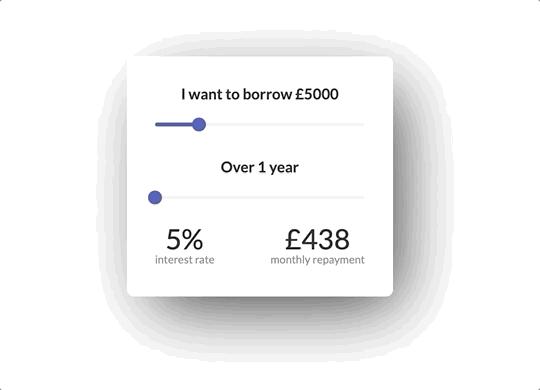

## React Loan Calculator

> Simple react loan calculator


Drag sliders and get an accurate loan amount.

## Preview




## Installation

### Setup

```sh
git clone https://github.com/bless4/react-loan-range-slider.git
cd react-loan-calculator
npm install
npm start
```

### Tests

```sh
npm run test
```

## Documentation

### Amount Range Slider

- A controlled component that can accept number values between 1000 and 20000
- Increases or decreases by a number value of 100 at a time ('step' prop)

### Years Range Slider

- A controlled component that can accept number values between 1 and 5
- The values indicate the amount of years rather than months
- Increases or decreases by a number value of 0.5 years at a time ('step' prop), to represent changes of 6 months at a time

### Display component

- Must have two props: 'years' and 'amount', both values are numbers.

### DisplayChild component

- Must have two props: 'func' and 'text'. 'Func' takes in a function as its value and 'text' a string.
#react-loan-range-sider
